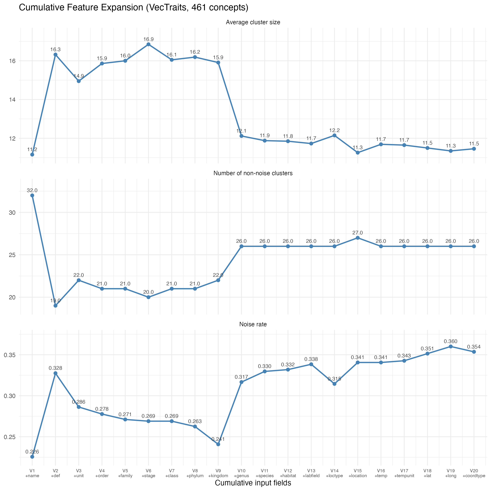
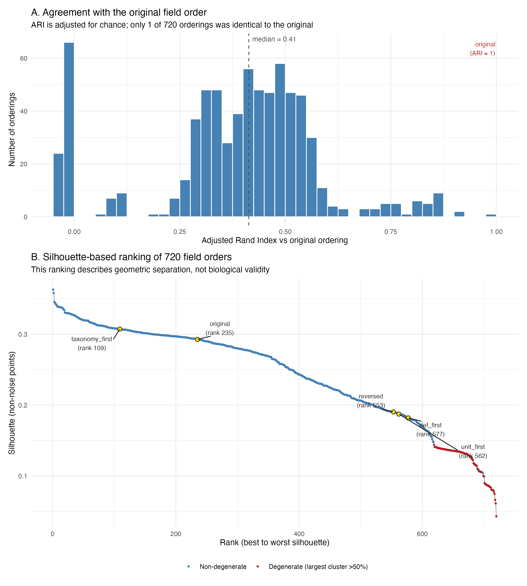
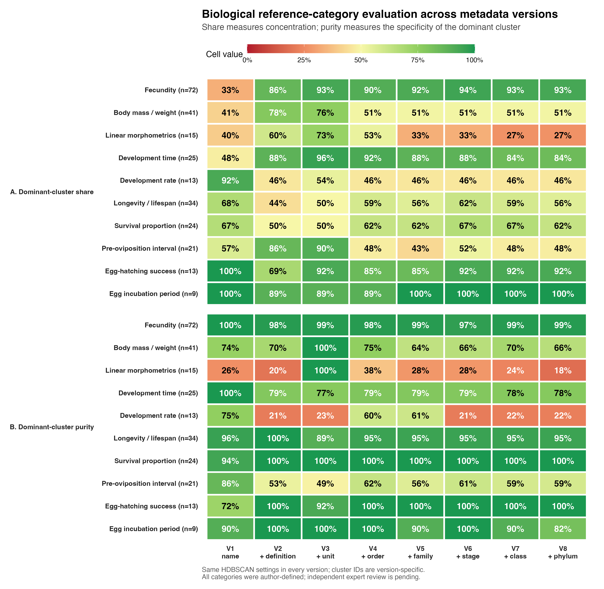

# LLM-assisted semantic clustering of vector trait concepts

This repository contains the code, data and saved outputs for an MSc project on organising heterogeneous trait descriptions in the VecTraits database. The project uses OpenAI semantic embeddings and HDBSCAN to generate **candidate trait concept groups** that can support expert-led controlled-vocabulary curation.

The analysis is based on 41,147 VecTraits records. After trimming text and retaining one row for each distinct `(OriginalTraitName, OriginalTraitDef)` pair, the working dataset contains 461 operational trait concepts. The unit is not part of the deduplication key, but the retained unit is included in relevant text representations.

## Project scope

The current project asks whether language-model embeddings can help organise trait descriptions by biological meaning. It does not present a completed controlled vocabulary, and it does not demonstrate an improvement in database search performance. Cluster membership, preferred labels, synonyms and broader/narrower relationships still require expert review.

Earlier OBA/PATO ontology-mapping experiments are retained for provenance, but they are not part of the final analytical direction. Searchability is treated as a possible downstream use of a reviewed vocabulary rather than as an outcome tested here.

## Repository structure

The tree below highlights the files used in the final workflow and groups older exploratory files rather than listing every output separately.

```text
MasterProject/
├── README.md
├── Master Project.Rproj
├── Code/
│   ├── analysis.R                         # heterogeneity analysis and initial embedding workflow
│   ├── input_EXPANSION.R                  # cumulative V1-V20 feature expansion
│   ├── Ordering_experiment_720.R          # exhaustive ordering of six fixed fields
│   ├── order_search.R                     # simulated-annealing field-order searches
│   ├── diagnose_best_order.R              # inspection of high-scoring cluster contents
│   ├── body_size_ground_truth.py          # body-size reference-category construction
│   ├── build_additional_ground_truth.R    # seven additional reference categories
│   ├── multi_trait_heatmap.R              # V1-V8 share/purity evaluation and heat map
│   ├── groundtruth_permutation_analysis.R # re-ranking of 720 orders using reference categories
│   ├── triple_field_permutation_336.R     # all ordered three-field inputs from V1-V8
│   ├── plot_feature_expansion.R           # rebuilds the feature-expansion figure
│   ├── ordering720_plot.R                 # rebuilds the field-order figure
│   ├── GMM_vs_HDBSCAN.R                   # supporting clustering-method comparison
│   ├── wing_length_ground_truth.py        # exploratory narrow-category audit
│   └── mapping.R, oba:pato.R, Label.R...  # legacy ontology/label experiments
├── Data/
│   ├── VecTraits.csv                      # primary input: 41,147 records
│   └── BiotraitsFieldNames.csv            # source field descriptions
└── Results/
    ├── featexp_label_matrix.csv            # 461 concepts × V1-V20 cluster assignments
    ├── featexp_rarefaction.csv              # cluster/noise summary for V1-V20
    ├── featexp_silhouette.csv               # saved silhouette values
    ├── fecundity_tracking.csv               # fecundity membership and V1-V8 labels
    ├── body_size_tracking.csv               # body-size membership and V1-V8 labels
    ├── additional_trait_ground_truth.csv    # seven additional reference categories
    ├── multi_trait_ground_truth_used.csv    # combined ten-category reference set
    ├── multi_trait_heatmap_scores.csv       # category-level share and purity
    ├── multi_trait_version_summary.csv      # version-level macro summaries
    ├── ordering_720_groundtruth_*.csv/rds   # reference-based six-field ordering results
    ├── triple_permutation_336/               # ordered three-field analysis
    ├── featexp_rarefaction_curve.png
    ├── ordering_720_summary.png
    ├── multi_trait_heatmap.png
    └── ontology-related files               # legacy exploratory outputs
```

Large embedding caches, `.npy` matrices, local R session files and `Data/GlobalDataset.csv` are excluded from version control. The saved label matrices and compact result files needed for the final downstream evaluations are included.

## Analysis workflow

1. **Measure semantic heterogeneity.** Count variation in trait names, definitions and units in the original VecTraits records.
2. **Create a common analysis base.** Trim relevant text fields and retain 461 distinct name-definition pairs in a fixed row order.
3. **Embed and cluster descriptions.** Encode structured text with `text-embedding-3-large` (3,072 dimensions), then run HDBSCAN with `min_cluster_size = 5`, `min_samples = 3` and Euclidean distance.
4. **Expand the input cumulatively.** V1 begins with trait name. Each later version adds one field, producing V1-V20:

   | Version | Field added | Version | Field added |
   |---|---|---|---|
   | V1 | name | V11 | species |
   | V2 | definition | V12 | habitat |
   | V3 | unit | V13 | lab/field |
   | V4 | order | V14 | location type |
   | V5 | family | V15 | location |
   | V6 | life stage | V16 | temperature |
   | V7 | class | V17 | temperature unit |
   | V8 | phylum | V18 | latitude |
   | V9 | kingdom | V19 | longitude |
   | V10 | genus | V20 | coordinate type |

5. **Test field-order sensitivity.** Exhaustively evaluate all 720 orders of a fixed six-field input and use simulated annealing for larger search spaces. Inspect cluster contents to determine whether high geometric scores represent trait semantics or repeated identity metadata.
6. **Evaluate against reference categories.** Track ten manually defined categories across V1-V8 and calculate dominant-cluster share and purity. Re-rank the 720 six-field orders with these reference-based measures, then evaluate all 336 ordered three-field inputs drawn from the V1-V8 field set.

## Reference categories and evaluation measures

The ten author-defined reference categories are fecundity, body mass/weight, linear morphometrics, development time, development rate, longevity/lifespan, survival proportion, pre-oviposition interval, egg-hatching success and egg incubation period. Together they contain 267 category memberships. The seven categories generated by `build_additional_ground_truth.R` are provisional and await independent expert review.

For a target category:

- **Dominant-cluster share** is the number of target concepts in that category's largest non-noise cluster divided by the total number of target concepts. It measures how well related concepts are brought together.
- **Dominant-cluster purity** is the number of target concepts in the dominant cluster divided by the total size of that cluster. It measures how much unrelated material is mixed into the cluster.
- **Balanced score** is the harmonic mean of dominant-cluster share and purity.
- HDBSCAN label `-1` denotes noise. Cluster identifiers are meaningful only within a single version or configuration and must not be compared directly across versions.

## Main findings

- Adding the definition caused the largest early change in cluster structure and brought many differently worded but related concepts together.
- Trait-level fields such as name, definition and unit were more useful for candidate semantic grouping than organism or location identity fields.
- Taxonomic and geographic fields could produce compact clusters organised by genus or coordinates rather than by trait meaning.
- Silhouette alone was therefore not a reliable biological ranking criterion. Across the 720 six-field orders, silhouette and mean dominant-cluster share were negatively associated (Spearman `r = -0.374`; Pearson `r = -0.674`).
- In the original V1-V8 sequence, V3 (name + definition + unit) had the highest mean dominant-cluster share (`0.764`) and mean purity (`0.829`) across the ten categories. No single version was best for every category.
- Among 336 ordered three-field inputs, `name > definition > unit` had the highest non-degenerate mean balanced score (`0.765`). The same three fields behaved differently when reordered, so this result is a useful starting configuration rather than a universal or order-invariant optimum.

These findings support a human-in-the-loop workflow: clustering narrows the material that experts need to inspect, while specialists determine the final concept boundaries and labels.

## Key figures

### Cumulative feature expansion



### Field-order sensitivity and silhouette ranking



### Ten-category reference evaluation



## Reproducing the saved-result analyses

The project was developed mainly in R/RStudio, with Python called through `reticulate` using a conda environment named `pymc-env`. Run scripts from the `MasterProject` directory so that relative file paths resolve correctly.

Main R dependencies include `tidyverse`, `readr`, `dplyr`, `stringr`, `tidyr`, `ggplot2`, `patchwork`, `gtools`, `mclust`, `digest`, `httr`, `jsonlite` and `reticulate`. Main Python dependencies include `numpy`, `pandas`, `hdbscan`, `scikit-learn` and `openai`.

The following steps use the saved V1-V20 assignments or saved permutation labels and do **not** call the embedding API:

```bash
python3 Code/body_size_ground_truth.py
Rscript Code/build_additional_ground_truth.R
Rscript Code/multi_trait_heatmap.R
Rscript Code/groundtruth_permutation_analysis.R
Rscript Code/plot_feature_expansion.R
Rscript Code/triple_field_permutation_336.R --validate-only
```

`groundtruth_permutation_analysis.R` reuses `Results/ordering_720_groundtruth_labels.rds`. If that file is removed, the ignored embedding cache is needed to reconstruct the labels.

## Re-running embeddings

Embedding-dependent scripts can incur API costs. They should only be run when regeneration is intentional. Set the API key in the R session or environment; never save it in a script or commit it to Git:

```r
api_key <- rstudioapi::askForPassword("OpenAI API key")
stopifnot(nzchar(api_key))
Sys.setenv(OPENAI_API_KEY = api_key)
rm(api_key)
```

Some early scripts contain machine-specific working-directory or Python-environment paths. Update those paths before attempting a full rerun. In particular, `analysis.R` retains an empty `OPENAI_API_KEY` assignment as a safety placeholder; it must not overwrite the securely set session key during an intentional API run.

The 336 ordered three-field experiment can be validated without API access using the command above. A fresh run requires the API key and should be allowed to reuse its checkpoint files so completed inputs are not embedded again.

## Interpretation and reuse notes

- The 461 rows are operational name-definition concepts, not an externally validated ontology.
- The retained unit and other metadata come from one source row for each name-definition pair and may not represent all variants present in the 41,147-row dataset.
- Reference categories were curated for evaluation and can overlap conceptually; they should not be treated as a finished set of mutually exclusive vocabulary terms.
- Noise records may be rare valid traits, unusually specific measurements, curation errors or unresolved concepts. They should not be deleted automatically.
- Results depend on field selection, field order, model choice and HDBSCAN settings.

## Legacy exploratory work

Files related to OBA/PATO mapping, older labelling attempts, GMM comparisons and early 467-row embedding experiments are retained to document the development of the project. They are not the baseline for the final results. The final analyses use the aligned 461-row `featexp_label_matrix.csv` and the reference-based evaluation files listed above.

## Author

Daniel Zhu  
MSc Computational Methods in Ecology and Evolution  
Imperial College London
